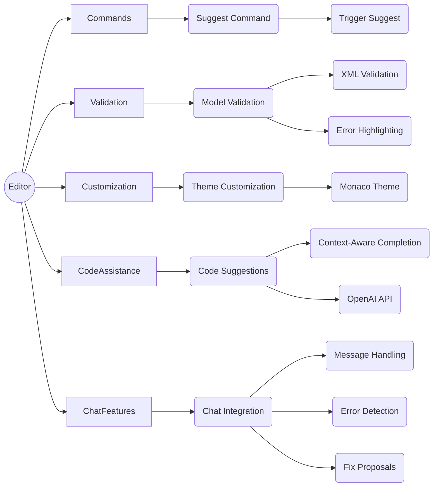

# Copilot for Monaco-based custom IDEs (custom-copilot-demo)

This repository contains an implementation of an AI-assisted code editor that provides intelligent code suggestions, XML validation, error highlighting, theme customization, and chat integration. The editor leverages the Monaco editor and the OpenAI API to enhance the coding experience.

## Architecture Overview

The architecture of the AI-assisted code editor can be visualized using the following Mermaid diagram:




## Key Features

### 1. Suggest Command

The `SuggestCommand` feature allows users to trigger code suggestions using a keyboard shortcut (Alt + Space). It is implemented in the `EditorInitializer` class ([src/components/Editor/EditorInitializer.js](https://github.com/aymenfurter/custom-copilot-demo/blob/main/src/components/Editor/EditorInitializer.js#L22-L29)).

``` javascript
const triggerSuggestCommand = this.monaco.KeyMod.Alt | this.monaco.KeyCode.Space;
const contextCondition = 'editorTextFocus && !editorHasSelection && ' +
                         '!editorHasMultipleSelections && !editorTabMovesFocus && ' +
                         '!hasQuickSuggest';

editor.addCommand(triggerSuggestCommand, () => {
  editor.trigger('', 'editor.action.triggerSuggest', '');
}, contextCondition);
``` 

### 2. Model Validation

The `ModelValidation` feature performs XML validation on the editor content and highlights errors. It is implemented in the `XmlValidator` class ([src/components/Editor/XmlValidator.js](src/components/Editor/XmlValidator.js)).

``` javascript
validate() {
  const xmlDoc = this._parseXml();
  const errors = [
    ...this._validatePolicyAttributes(xmlDoc),
  ];

  this._setModelMarkers(errors);

  return errors;
}
``` 

### 3. Theme Customization

The `ThemeCustomization` feature applies a custom theme to the Monaco editor. The custom theme is defined in the `MonacoTheme` object ([src/components/Editor/MonacoTheme.js](src/components/Editor/MonacoTheme.js)).

``` javascript
_applyTheme() {
  this.monaco.editor.defineTheme('customTheme', this.editorTheme);
  this.monaco.editor.setTheme('customTheme');
}
``` 

### 4. Code Suggestions

The `CodeSuggestions` feature provides context-aware code completion suggestions using the OpenAI API. It is implemented in the `CodeSuggester` class ([src/components/Editor/CodeSuggester.js](src/components/Editor/CodeSuggester.js)).

``` javascript
async provideCompletionItems(model, position) {
  const textUntilPosition = this.getTextUntilPosition(model, position);

  if (textUntilPosition.length < 3) return { suggestions: [] };

  const suggestion = await this.generateContextAwareCodeSuggestion(
    textUntilPosition, 
    model.getValue(), 
    position
  );

  if (!suggestion) return { suggestions: [] };

  return this.buildCompletionSuggestion(suggestion, position);
}
``` 

### 5. Chat Integration

The `ChatIntegration` feature enables communication and error handling through the chat interface. It is implemented in the `ChatBox` component ([src/components/Chat/ChatBox.js](src/components/Chat/ChatBox.js)).

``` javascript
const handleMessageSent = async (message) => {
  setMessages((prevMessages) => [...prevMessages, { type: 'user', text: message }]);
  setIsStreaming(true);
  setHasErrors(false);
  const currentModel = monaco.editor.getModels()[0];
  const currentCode = currentModel.getValue();

  const response = await fetch('https://api.openai.com/v1/chat/completions', {
    method: 'POST',
    headers: {
      'Content-Type': 'application/json',
      Authorization: `Bearer ${apiKey}`,
    },
    body: JSON.stringify({
      model: 'gpt-4',
      messages: [
        {
          role: 'system',
          content:
            'You are an AI assistant that helps with coding and Azure API Management policy development. Provide helpful suggestions and answers based on the code context and user messages.',
        },
        {
          role: 'user',
          content: `Here's the current code:\n\n${currentCode}\n\nUser message: ${message}`,
        },
      ],
      max_tokens: 500,
      n: 1,
      stream: true,
      temperature: 0.7,
    }),
  });

  // Process the response and update the chat messages
  // ...
};
``` 

## Usage

To use the AI-assisted code editor:

- Clone the repository: `git clone https://github.com/aymenfurter/custom-copilot-demo.git`
- Install the dependencies: `npm install`
- Set up your OpenAI API key in the App
